# Title

**Peak-aware Federated Learning with a Round-wise Global Codebook for Individual Household Electric Load Forecasting**

*(저자 표기는 학회 양식에 맞춰 — Authors, Affiliations, Corresponding author 추가 예정)*

---

# 1. Introduction

> 한 문단 + 핵심 bullet로 압축. 상세 배경(그리드 운영·DR·ESS 활용)은 발표 구두 설명으로.

Accurate household-level **peak** load forecasting is important for demand-side
management and grid operation, yet it remains challenging because individual
consumption is highly volatile and heterogeneous. Federated learning (FL) lets
households train a shared model **without centralizing privacy-sensitive load
data**, but conventional FL **underfits the rare, sharp peak events** — especially
for households with limited history.

- **Why peaks, why per-household**: 계통 운영(예비력·송배전 설비)은 *최대 부하의 크기·시점*을
  기준으로 결정된다. 최근 DER·V2G·가정용 ESS 확산으로 의사결정 단위가 *집계 부하 →
  개별 가구*로 이동 중 → 가구 단위 peak 예측의 중요성 급증.
- **Privacy**: 가구 단위 데이터는 민감 정보 → 중앙 집중 학습 부담 → FL 필요.
- **Gap**: 기존 FL은 평균(MAE)에 최적화되어 peak 영역을 과소적합.

*(Figure 1 자리: 가구-서버-클라우드 federated 구조 + peak 예측 개념도 — 삽입 예정)*

---

# 2. Problem Statement

> 데이터·문제 정의를 여기서 한 번에. 설명은 줄이고 "무엇이 어려운가"에 집중.

## 2-1. Data

- **UMass Smart\* 2016**, 시간 단위(hourly) 가정용 부하. **114 가구**.
- per-client **70 / 10 / 20** chronological split, per-apartment **z-norm (train 구간 통계만 사용)**.
- look-back **L = 96 (4일)** → horizon **H = 24 (1일)** 예측.

## 2-2. 개별 가구는 Trend·Seasonality가 희소하다

- 직관과 달리 가구의 peak 시간대는 **매일 크게 바뀐다 (high day-to-day variability)**.
  - 연/분기 단위에선 trend 존재(여름·겨울 부하↑)
  - 그러나 **일·주 단위에선 trend·seasonal 신호가 희소** → 구조적 basis로 설명되지 않는 잔차가 큼.
- 오히려 **가구 간(cluster 간) 패턴 유사성**이 개별 가구 내 주기성보다 강하다[^1]
  → "공유할 정보는 가구 내 주기성이 아니라 **가구 간 잔차 패턴**"이라는 단서.

## 2-3. Problem definition

$K$개 가구 $\mathcal{H}=\{h_i\}_{i=1}^{K}$, 각 가구는 사적 학습 윈도 $\mathcal{D}_i$를 보유.
윈도는 $(x, y)$, $x\in\mathbb{R}^{L}$ (look-back), $y\in\mathbb{R}^{H}$ (horizon).

> **목표**: raw 부하를 전송하지 않고, 각 가구에 대해 **peak 진폭 정확도**를 개선한
> 보정 예측 $\hat{y}$를 산출한다.

- 평가 지표: **PAPE (Peak Absolute Percentage Error)** — 하루 최대 부하의 *크기* 오차에 집중.
  (peak 영역만 보는 지표라 평균 MAE가 좋아도 PAPE는 나쁠 수 있음 → peak 전용 평가가 필요한 이유.)

---

# 3. Objective

> 선행 연구의 한계를 먼저 짚고, 그에 대한 응답으로 목적을 강조.

**선행 연구의 한계**
- (L1) Standard FL(FedAvg/FedProx 등)은 **평균 손실 최적화** → 희소한 peak를 과소적합.
- (L2) Personalized FL(FedRep/Ditto/FedProto)은 개인화 시 **추가 학습/파라미터**가 필요하고,
  backbone에 강하게 묶여 **알고리즘 교체가 어렵다**.
- (L3) Codebook/VQ 계열은 보통 backbone forward에 codebook을 끼워 **commitment loss·재학습**을 요구.

**Objective (G1–G3)**
- **G1 — RoundFL**: 114 가구가 매 라운드 학습에 참여, 각 가구 self-test 구간에서
  **라운드 단위 peak 정확도**를 추적. cold partition 폐기, 5개 FL(FedAvg/FedProx/FedRep/Ditto/FedProto)을
  **동일 프로토콜**로 비교.
- **G2 — RoundCB**: 매 라운드 종료 시 backbone hidden $h_g$로 **federated codebook**을 구성,
  cluster 평균 잔차(offset)로 예측 보정. backbone forward를 거치지 않아 **모든 FL 알고리즘에 직교(orthogonal)**.
- **G3 — Efficiency**: 큰 모델·추가 학습 없이 **task-aligned inductive bias + inference-time
  personalization** 만으로 standard FL 대비 peak 정확도 향상.

---

# 4. Method

> 큰 그림은 단순하게. 먼저 Preliminaries로 backbone/FL을 정리한 뒤 RoundCB를 제시.

## 4-0. Preliminaries

**(a) Backbone — NBEATSx (Olivares et al., 2023)**
- `MinimalNBEATSx`, 3-stack (trend / seasonal / generic), **doubly-residual stacking**:
  각 stack이 backcast로 입력 잔차를 제거($r^{(s)} = r^{(s-1)} - b^{(s)}$)하고 forecast를 누적.
- **generic stack의 hidden $h_g \in \mathbb{R}^{64}$** = trend·seasonal로 설명되지 않은
  잔차를 담는 표현 → codebook의 입력.

**(b) Federated learning**
- 서버가 $\theta^{(r)}$ 브로드캐스트 → 각 가구 $E$ epoch local SGD → **FedAvg**(window-count 가중)로 집계.
- 가구의 raw 부하는 절대 전송하지 않음.

*(Figure 2 자리: 가구(클라이언트) ↔ 서버 ↔ 클라우드 codebook의 federated 구조도 — 2안 채택)*

## 4-1. RoundCB Framework (R / A / C)

RoundCB는 두 phase로 동작한다.
- **Federated Representation Phase**: backbone을 FedAvg로 학습 — codebook은 손실에 들어가지 않음.
- **Round-wise Codebook Phase**: frozen backbone의 잔차 latent를 매 라운드 quantize→aggregate→offset.

codebook은 R(Representation) / A(Aggregation) / C(Correction) 세 축으로 분석. **RoundCB는 A·C에 집중.**

**R — Representation (별도 shaping 없음)**
- 매 라운드 종료 시 backbone에서 $h_g$를 *그대로* 추출. codebook이 forward를 거치지 않으므로
  **commitment loss 없음**.

**A — Aggregation (2-stage federated KMeans)**
- Stage-1 (client): 각 가구가 자기 $h_g$에 KMeans++($K_{\text{local}}=2$) → **(centroid, count)만 업로드**.
  raw $h_g$는 가구를 벗어나지 않음.
- Stage-2 (server): 업로드된 centroid에 **count-weighted** KMeans++($M=32$) →
  단일 글로벌 codebook $C\in\mathbb{R}^{32\times64}$ 브로드캐스트.
- 이 count-weighted 집계는 **FedProto(Tan et al., 2022)**의 per-class prototype 집계를
  codebook으로 일반화한 것 — pooled KMeans와 동등 품질 (utilization 1.0, perplexity ≈ 26).

**C — Correction (Cluster-Mean Offset, CMO)**
- cluster별 평균 training 잔차 $O\in\mathbb{R}^{32\times24}$ 를 federated 산출
  (cluster별 잔차합·count만 업로드).
- 추론 보정: $\hat{y}_{\text{corr}} = \hat{y}_{\text{base}} + \alpha\cdot O[c^\*]$,
  $\;c^\* = \arg\min_c \lVert h_g - C_c\rVert_2,\;\alpha=1.0$.

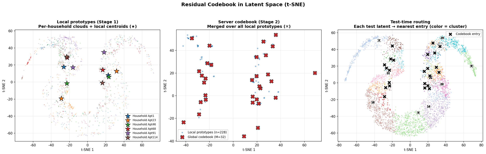
*Latent space (t-SNE): (좌) 가구별 local prototype(★) → (중) 서버에서 merge된 global codebook(✕) → (우) test latent을 최근접 codebook entry로 routing (색=cluster). R/A/C 파이프라인의 시각적 요약.*

## 4-2. Inference-time Personalization

- cold-start 없이, 각 test window의 $h_g$를 글로벌 codebook에 **1-NN routing** →
  해당 cluster offset으로 개인화 보정.
- **추가 backprop·파라미터 업데이트 불필요** → 추론 시점 개인화.

**강점 요약**
- **Backbone-agnostic**: forward가 codebook을 거치지 않아 어떤 FL backbone에도 그대로 얹힘.
- **Privacy-preserving**: raw $h_g$ 미전송 — centroid·count·잔차합만 업로드.
- **No extra training**: backbone freeze 후 post-hoc 구성.

---

# 5. Experiments

> Data·문제 정의는 §2(Problem Statement)에서 설명 완료. 여기서는 setup·비교 설계만.

- **Setup**: UMass Smart\* 2016, 114 가구, R = 20 rounds, 5 FL 알고리즘, seeds {42, 123, 7} (mean ± std).
- **본 절의 모든 수치는 MAE-only (λ_aux = 0) 기준** — codebook 보정의 순수 효과를 분리하기 위함.

## 5-1. Round-Level FL: 알고리즘 등가성

codebook 적용 *전* test PAPE가 5개 알고리즘에서 **~1 PAPE 내로 수렴** → 이 스케일(114가구·R20)에서
알고리즘 선택은 PAPE discriminator가 아니다.

| FL backbone | test PAPE (codebook 전) |
|---|---|
| FedAvg | 52.53 ± 0.13 |
| FedProx | 52.48 ± 0.16 |
| FedRep | 52.44 ± 0.70 |
| Ditto | 53.35 ± 0.34 |
| FedProto | 52.59 ± 0.13 |

→ 실질적 선택 기준은 **비용 효율**(예: FedRep, 통신량 ↓).

## 5-2. Global Model (centralised) 비교

- **Global Model = 모든 가구의 train 윈도를 풀링해 학습한 중앙집중 상한**.
- 참조값(v06, pooled-SGD + MAE-only): codebook 전 ≈ **48.9 PAPE**, codebook 후 ≈ **44.4 PAPE**.
- 의미: federated(분산) 학습이 Global Model 대비 갖는 PAPE 손실은 작고, **codebook 보정이
  그 격차를 추가로 좁힌다**.

> [TODO] v09 프로토콜(114가구·R20)에서 Global Model cell 직접 실행하여 동일 표에 채울 것.
> 현재는 동일 method·MAE-only 조건의 v06 값을 reference로 인용.

## 5-3. Codebook + Aux head ablation

- 처음엔 보조 MLP(Aux head)로 local peak 정보를 보완할 수 있을지 검토했으나,
  **codebook 적용 전 PAPE는 aux 유무와 무관하게 거의 동일** → aux head 단독 효과는 미미.
- 본 발표 수치를 **MAE-only(aux=0)** 로 고정한 이유: lift의 주된 원천이 aux가 아니라
  **codebook 보정(RoundCB의 A+C)** 임을 분리해 보이기 위함.

---

# 6. Result

We evaluate peak-region accuracy with **PAPE**. Against standard FL baselines, RoundCB
achieves the best peak accuracy, **reducing PAPE by ~9 %** vs the best standard FL baseline,
**without increasing model scale**. → task-aligned inductive bias + inference-time
personalization이 모델 규모 확대보다 효과적일 수 있음.

> [TODO] local / TSFM(TimesFM 등) baseline 수치 미확보 — 실행 후 추가.

## 6-1. RoundCB Codebook Lift (v09, R = 20, MAE-only, 3-seed mean ± std)

| FL backbone | BEFORE PAPE | **AFTER PAPE** | **ΔPAPE** |
|---|---|---|---|
| FedAvg | 52.53 ± 0.13 | 47.85 ± 0.50 | −4.68 ± 0.64 |
| FedProx | 52.48 ± 0.16 | 47.68 ± 0.55 | −4.80 ± 0.71 |
| FedRep | 52.44 ± 0.70 | 47.99 ± 0.54 | −4.45 ± 0.86 |
| Ditto | 53.35 ± 0.34 | 47.83 ± 0.47 | −5.52 ± 0.62 |
| FedProto | 52.59 ± 0.13 | 47.75 ± 0.61 | −4.84 ± 0.73 |

- **Lift 보편성**: 5개 FL backbone 전부 **−4.5 ~ −5.5 PAPE** → codebook은 backbone-agnostic 보정 모듈.
- **best standard FL 대비**: 52.48 → 47.68 = **약 9 % 상대 PAPE 감소** (모델 규모 확대 없이).
- **MAE 비용 거의 없음**: test MAE 0.503 → 0.510 (+0.007, ≈ +1.4 % relative) — peak 개선이 평균을 해치지 않음.

**Figures** (`figures/`, 3-seed mean ± std, 114 households):

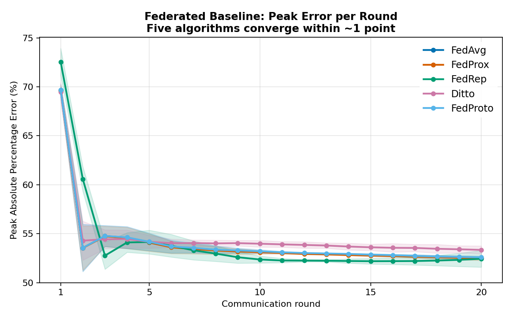
*Fig 1. Federated baseline: 5개 FL 알고리즘의 라운드별 peak error가 ~1 PAPE 내로 수렴.*

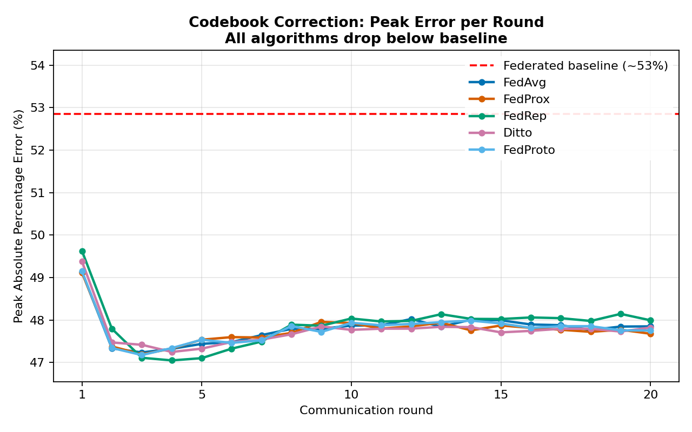
*Fig 2. Global codebook 보정 후: 모든 알고리즘이 baseline 아래로 하강.*

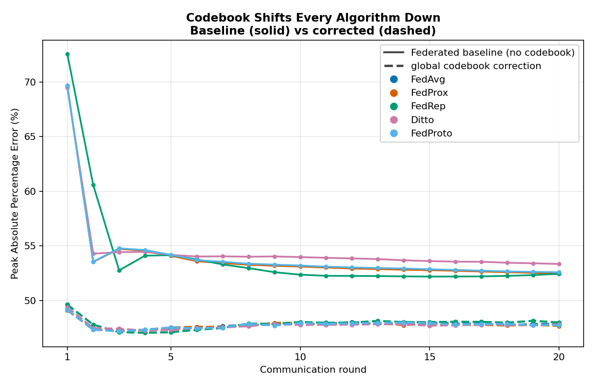
*Fig 2b. Fig 1·2 합본 — federated baseline(solid, ~52~53) vs codebook 보정(dashed, ~47~48). 두 cluster 간 간격이 곧 codebook lift.*

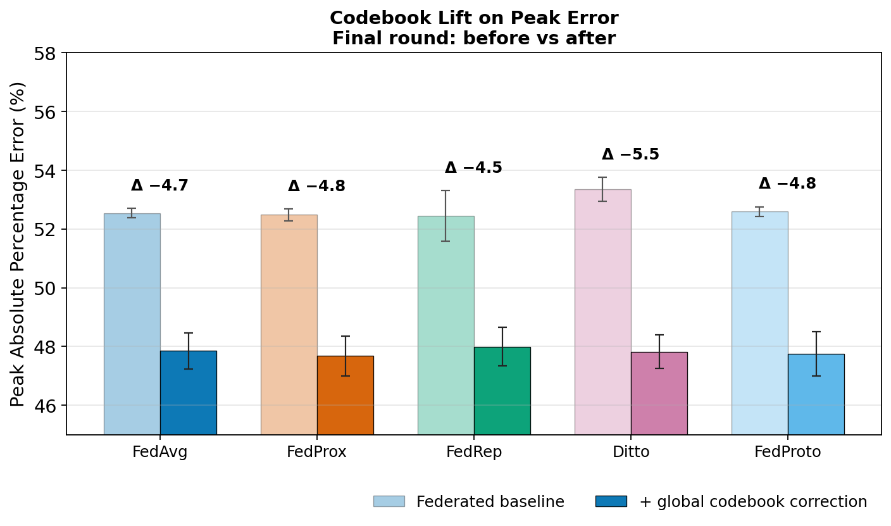
*Fig 3. 최종 라운드 peak error, 보정 전(연한) vs 후(진한) — 전 backbone에서 −4.5~−5.5 PAPE.*

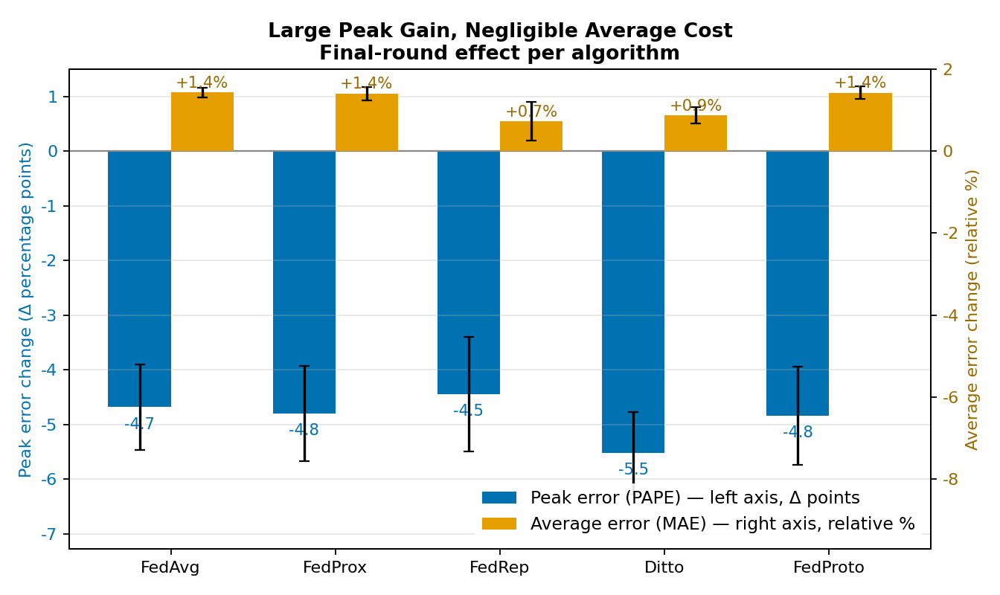
*Fig 4. 최종 라운드 per-algorithm: 보정은 peak error를 크게 낮추되(파랑, 좌축 Δpp) 평균 error는 거의 건드리지 않음(주황, 우축 +0.7~1.4%).*

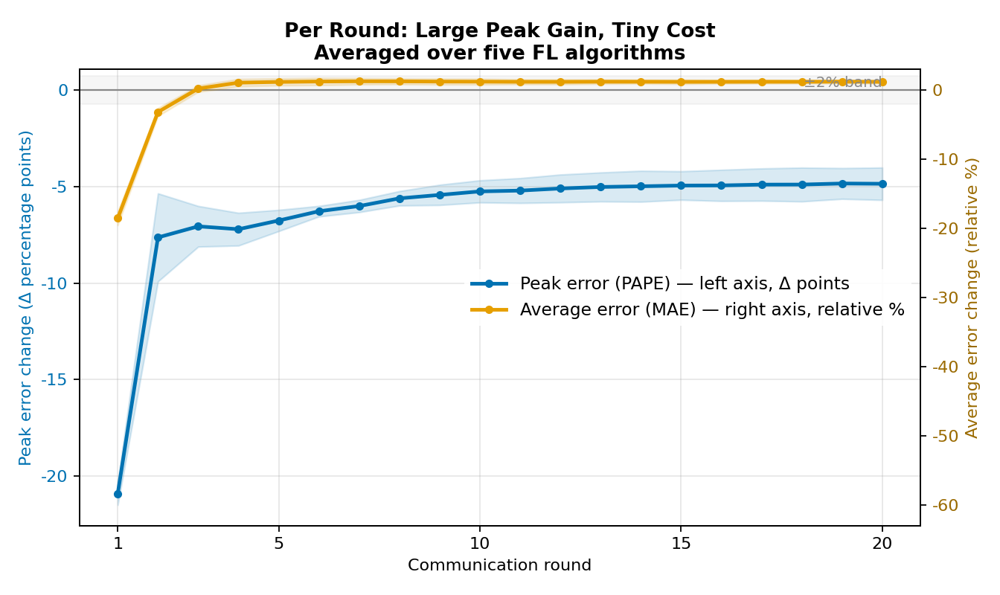
*Fig 5. 라운드별(5개 알고리즘 평균): peak error는 큰 폭으로 하락, 평균 error는 ±2% band 안에 머무름.*

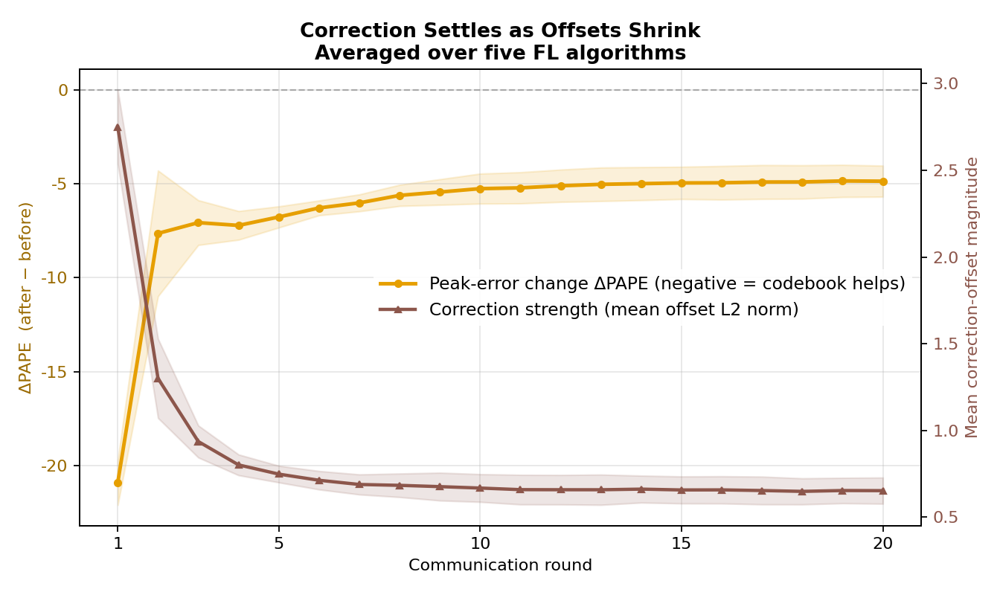
*Fig 6. 보정 offset의 크기(갈색, 우축)가 줄며 안정화될수록 ΔPAPE(주황, 좌축)가 −5 부근으로 수렴 → 보정이 라운드 진행과 함께 자리 잡음.*

**적용 범위 — peak 크기(PAPE)에 국한, peak 시각(HR@2)에는 전이되지 않음.** CMO 보정은
`ŷ_corr = ŷ_base + α·offset[c*]`로 클러스터 평균 offset을 horizon 전체에 **가산**하는 방식이라
peak의 *크기*는 옮기지만 peak의 *시각*(argmax 위치)은 거의 바꾸지 않는다. 실제로 peak-timing
hit rate(HR@2, ±2h 허용, 높을수록 좋음)는 수렴 후(R ≥ 2) 보정으로 개선되지 않으며 오히려 미세하게
낮아진다: 최종 라운드 baseline HR@2 ≈ 22.6–23.9 %, 보정 후 ≈ 21.6–23.0 %, **ΔHR@2 ≈ −0.4 ~ −1.0 pp**
(전 backbone). 즉 RoundCB의 lift는 "peak 시점에서의 *크기* 보정"으로 한정되며, peak *발생 시각*
예측은 별도 과제로 남는다.

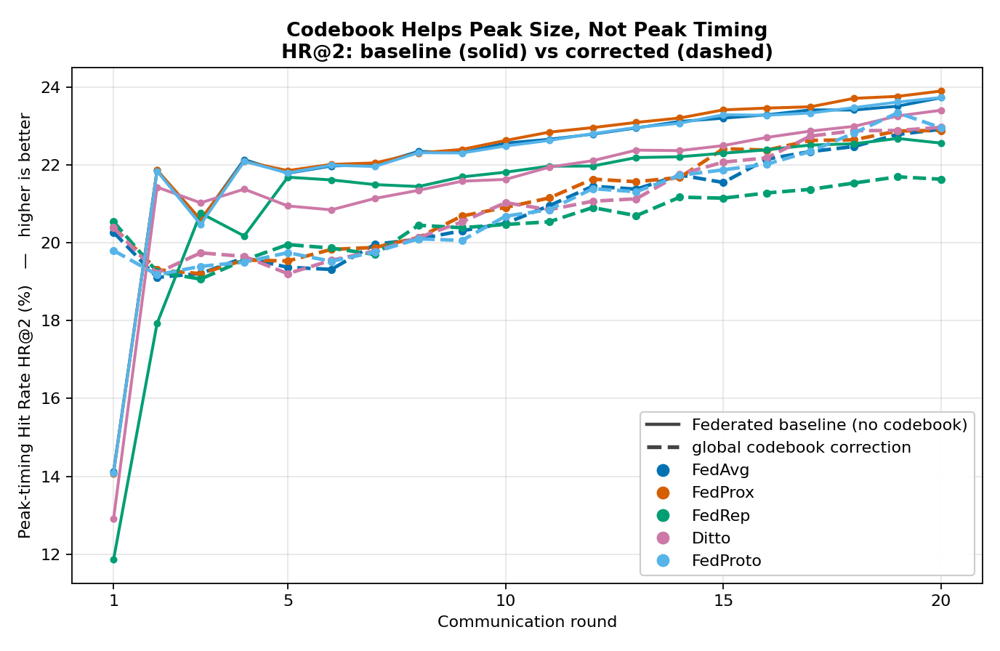
*Fig 6b. HR@2(peak 시각 hit rate, 높을수록 좋음): baseline(solid) vs codebook 보정(dashed).
R = 1은 미수렴 baseline 탓에 보정이 일시적으로 높지만, R ≥ 2부터 보정선이 baseline 아래로 깔린다.*

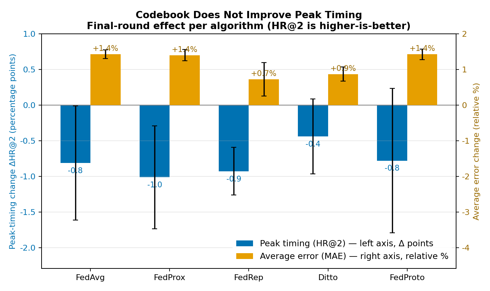
*Fig 6c. 최종 라운드 per-algorithm: ΔHR@2(파랑, 좌축)는 전 backbone에서 음수(−0.4~−1.0 pp),
MAE 비용(주황, 우축, +0.7~1.4%)은 Fig 4와 동일 — 보정은 timing을 개선하지 못한다.*

## 6-2. Ablation 요약

- **Aux head (λ_aux 0.3 → 0)**: codebook 전 PAPE 거의 불변 → lift는 codebook 주도(§5-3).
- **K_local (Stage-1)**: K = 2가 elbow. K = 1은 ~1 PAPE lift 손실, K = 8은 4× 업로드 비용 대비 sub-noise 이득.
- **α (correction strength)**: 0.5 (MAE-neutral) ~ 2.0 (PAPE-extreme)의 monotonic Pareto.
  응용의 peak-vs-MAE 가중에 따라 운영점 선택.

## 6-3. Codebook quality (federated codebook가 건강한가?)

- **No collapse**: utilization = **1.00**, empty cluster **0개** — 모든 라운드·모든 알고리즘에서.
  in-forward VQ(FedVQ)가 코드 collapse·respawn churn을 겪는 것과 대비.
- **High diversity**: perplexity ≈ **23–25 / 32** → 32개 코드가 거의 균등하게 활용 (near-uniform).
- **알고리즘 차이는 미세하나 일관**: FedRep이 routing balance(top-1 share 0.16)·compactness(inertia 141)에서
  가장 분산적, FedProto가 가장 compact(91). peak 정확도가 알고리즘 등가인 것과 마찬가지로 codebook 품질도
  알고리즘에 robust.

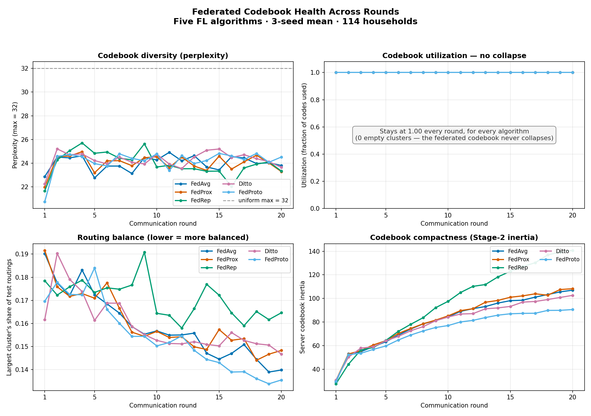
*Fig 8. 라운드별 codebook 건강 지표(5개 알고리즘): (A) perplexity는 max 32에 근접, (B) utilization은 1.0 고정(collapse 없음), (C) 최대 클러스터 점유율은 라운드가 갈수록 감소(균형↑), (D) Stage-2 inertia는 수렴.*

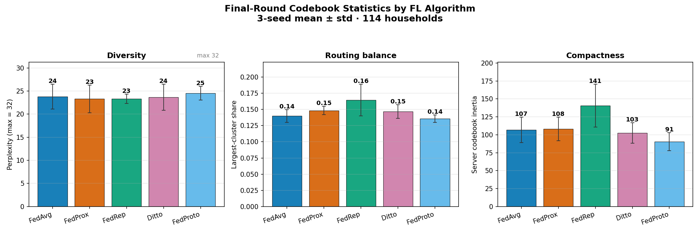
*Fig 9. 최종 라운드 codebook 통계 알고리즘 비교 — diversity / routing balance / compactness. 차이는 작고 일관적.*

---

# 7. Conclusion

- 개별 가구 peak 부하는 일·주 단위 주기성보다 **클러스터/그룹 특성 차이**로 결정됨[^1]
  → 라이프스타일을 codebook에 매칭하면 맞춤형 수요반응(DR) 설계에 활용 가능.
- **RoundCB는 method-agnostic 보정 모듈**: 어떤 FL backbone에도 직교적으로 **~−5 PAPE lift**를
  더하며, raw representation을 전송하지 않아 privacy를 보존.
- standard FL 대비 peak 정확도 **~9 % 상대 개선**(best FL 52.5 → 47.7 PAPE)을 모델 규모 확대 없이
  inference-time personalization으로 달성 → **"큰 모델보다 task-aligned bias + 개인화"**.

---

[^1]: Jin, Ling, et al. "Investigating Underlying Drivers of Variability in Residential Energy Usage Patterns with Daily Load Shape Clustering of Smart Meter Data." *arXiv preprint arXiv:2102.11027* (2021). https://arxiv.org/abs/2102.11027
